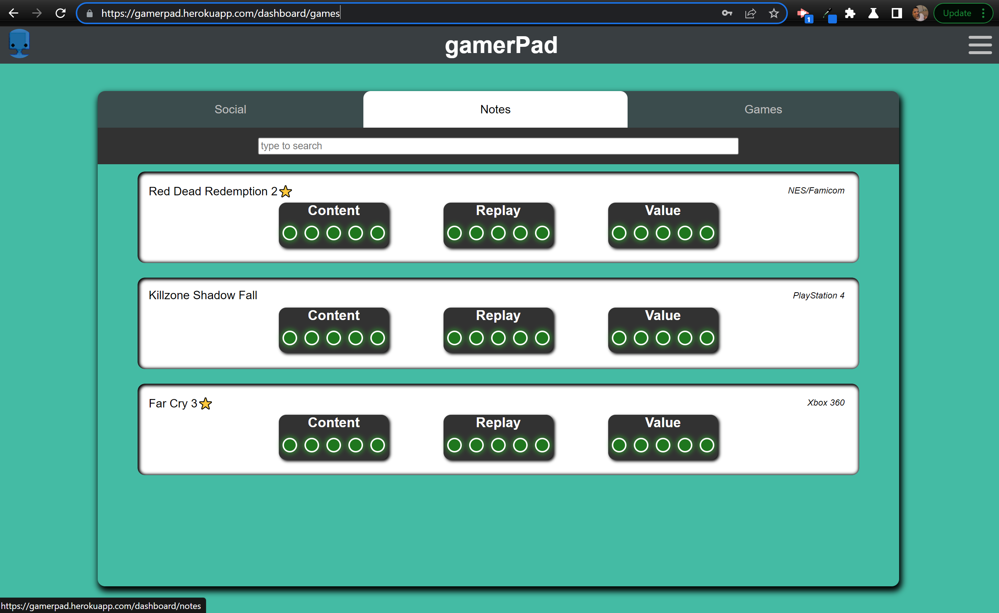

# GamerPad

## Table of Contents
   * [Description](#Description)
   * [Installation](#Installation)
   * [Usage](#Usage)
   * [Contribution](#Contribution)
   * [Testing](#Testing)
   * [Questions](#Questions)
   * [Contacts](#Contacts)

## Description

GamerPad is a social media platform designed by gamers for games, where the community can rate games, find friends with similar interests, and leave detailed notes about their adventures for themselves or their friends.

 

## Collaborators 
* Andy Gaudy - PM
* Kai Ropp - Github Admin
* Maya Cohen - Senior Programmer 
* Tyler Brown - Senior Programmer 

 

## Installation

You need to clone both the gamerPad and gamerPad-frontend repos, install the json packages, launch the server with "node server.js" in the backend terminal and run "npm start" in the front end terminal. 

Voila, you have yourself a GmerPad. 

It's much easier to just visit our page. Links below.

 

## Usage

Use our app to connect with friends, create a profile of all your gaming accounts and a library of games you play, and leave notes for yourself and friends regarding your progress or cheat codes.

 

## Contribution

We are currently not accepting any contributions. But if you are interested in collaborating in the future please contact any of us using our details listed below.

 

## Testing

Please report bugs to any of the contacts listed below.

 

## Questions

If you have any questions or comments regarding this application please contact any of us in the list below:

 

# Contacts

**Andy Gaudy - PM:**

&emsp;Github: [maximusDecimalusMeridius](https://github.com/maximusDecimalusMeridius)

&emsp;Email: **please add your email here**

**Kai Ropp - Github Admin:**

&emsp;Github: [kairo97](https://github.com/kairo97)

&emsp;Email: **please add your email here**

**Maya Cohen - Senior Programmer:**

&emsp;Github: [Mayalynn96](https://github.com/Mayalynn96)

&emsp;Email: **please add your email here**

**Tyler Brown - Senior Programmer:**

&emsp;Github: [OneDeadFox](https://github.com/OneDeadFox)

&emsp;Email: tjosephb.pro@gmail.com